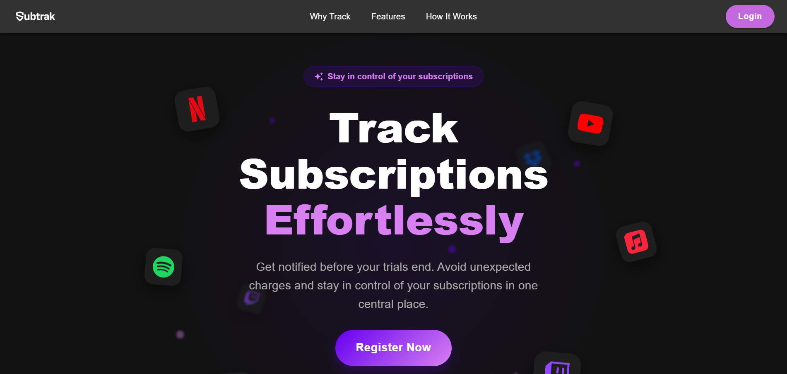

# Subtrak

<p align="center">
  
</p>

Subtrak is a full-stack subscription tracker that brings recurring expenses and one-time purchases into one dashboard. It helps users understand what they are paying for, see upcoming renewals, review spending trends, and receive email reminders before a subscription renews.

The application uses Google Sign-In for authentication, a responsive React interface for managing subscriptions, and a Spring Boot API backed by PostgreSQL.

## Features

- **Google authentication** — sign in with a Google account and use JWT-based access and refresh tokens.
- **Subscription management** — create, view, edit, and delete recurring subscriptions and one-time purchases.
- **Flexible billing cycles** — track billing intervals in days, weeks, months, or years.
- **Detailed records** — save the cost, category, start date, description, payment method, and website for each subscription.
- **Financial dashboard** — view estimated monthly spending, projected yearly spending, active subscription count, and the next billing date.
- **Spending insights** — explore a six-month spending chart and a category-by-category cost breakdown.
- **Renewal calculations** — automatically calculate the next billing date and total paid for recurring subscriptions.
- **Email reminders** — schedule renewal notifications with a configurable lead time, delivered through SendGrid.
- **Personal preferences** — configure theme, language, currency, timezone, and email notification preferences.
- **Internationalization** — includes English, Sinhala, Spanish, French, German, Japanese, and Chinese translations.
- **Responsive design** — a Material UI interface with light and dark themes for desktop and mobile screens.
- **Protected user data** — authenticated API routes scope subscription records to the signed-in user.

## Tech Stack

### Frontend

- React 19 and TypeScript
- Vite
- Material UI
- Redux Toolkit
- React Router
- Recharts
- Formik and Yup
- Axios
- i18next

### Backend

- Java 25
- Spring Boot 4
- Spring Security and stateless JWT authentication
- Spring Data JPA / Hibernate
- PostgreSQL
- Google OAuth token verification
- SendGrid email delivery
- Maven

## Project Structure

```text
subscription_tracker/
├── webapp/                 # React + TypeScript frontend
│   ├── public/             # Static assets
│   └── src/
│       ├── api/            # API client and requests
│       ├── app/            # Redux store and application state
│       ├── components/     # Reusable UI components
│       ├── features/       # Feature-specific state
│       ├── locales/        # Translation files
│       ├── pages/          # Main application pages
│       └── theme/          # Material UI theme configuration
└── subscription-service/   # Spring Boot REST API
    └── src/main/
        ├── java/           # Auth, subscription, user, and notification logic
        └── resources/      # Configuration and email template
```

## Getting Started

### Prerequisites

Install the following before running the project locally:

- Node.js and npm
- Java 25
- PostgreSQL
- A Google OAuth 2.0 web client
- A SendGrid account and verified sender if you want email reminders

### 1. Clone the repository

```bash
git clone <your-repository-url>
cd subscription_tracker
```

### 2. Create a PostgreSQL database

Create an empty PostgreSQL database for Subtrak. Hibernate is configured with `ddl-auto=update`, so the application will create and update the required tables when the backend starts.

### 3. Configure the backend

The backend reads the following environment variables:

| Variable              | Description                                                                 |
| --------------------- | --------------------------------------------------------------------------- |
| `DB_URL`              | JDBC connection URL, for example `jdbc:postgresql://localhost:5432/subtrak` |
| `DB_USERNAME`         | PostgreSQL username                                                         |
| `DB_PASSWORD`         | PostgreSQL password                                                         |
| `GOOGLE_CLIENT_ID`    | Google OAuth web client ID                                                  |
| `JWT_SECRET`          | Secret used to sign JWTs; use a strong value of at least 32 bytes           |
| `SENDGRID_API_KEY`    | SendGrid API key                                                            |
| `SENDGRID_FROM_EMAIL` | Verified sender email address                                               |
| `SENDGRID_FROM_NAME`  | Sender name shown in reminder emails                                        |

You can export these variables in your shell or provide them through your IDE's run configuration.

Set `FRONTEND_ORIGINS` to the comma-separated frontend origins that may call the API, for example `https://app.example.com,https://admin.example.com`. Do not include paths or trailing slashes. The default includes the local Vite origin and the current hosted frontend.

Start the API:

```bash
cd subscription-service
./mvnw spring-boot:run
```

On Windows PowerShell, use:

```powershell
cd subscription-service
.\mvnw.cmd spring-boot:run
```

The API runs on `http://localhost:8080` by default.

### 4. Configure the frontend

Create `webapp/.env.local`:

```env
VITE_GOOGLE_CLIENT_ID=your-google-client-id
VITE_API_BASE_URL=/api
```

The Google client ID must match the one configured for the backend. Add `https://localhost:5173` as an authorized JavaScript origin in the Google Cloud Console.

Install dependencies and start the frontend:

```bash
cd webapp
npm install
npm run dev
```

Vite serves the application over HTTPS at `https://localhost:5173` and proxies `/api` requests to the backend at `http://localhost:8080`.

Because local HTTPS uses a development certificate, your browser may ask you to accept the certificate the first time you open the site.

## Available Scripts

Run these commands from the `webapp` directory:

```bash
npm run dev       # Start the Vite development server
npm run build     # Type-check and create a production build
npm run lint      # Run ESLint
npm run preview   # Preview the production build locally
```

Run these commands from the `subscription-service` directory:

```bash
./mvnw spring-boot:run   # Start the API
./mvnw test              # Run backend tests
./mvnw package           # Build the backend JAR
```

## API Overview

### Interactive API documentation

When the backend is running, Swagger UI is available at:

```text
https://localhost:8080/swagger-ui.html
```

The generated OpenAPI documents are available at:

```text
https://localhost:8080/v3/api-docs
https://localhost:8080/v3/api-docs.yaml
```

Use Swagger UI's **Authorize** action with an access token for protected endpoints.
Do not provide a refresh token. Set `SWAGGER_ENABLED=false` to disable both the
interactive UI and generated API documents where public documentation is not desired.

| Method   | Endpoint              | Purpose                               |
| -------- | --------------------- | ------------------------------------- |
| `POST`   | `/auth/google`        | Sign in with a Google credential      |
| `POST`   | `/auth/refresh`       | Refresh an expired access token       |
| `POST`   | `/auth/logout`        | Clear the refresh-token cookie        |
| `GET`    | `/subscriptions`      | List the current user's subscriptions |
| `GET`    | `/subscriptions/{id}` | Get a subscription                    |
| `POST`   | `/subscriptions`      | Create a subscription                 |
| `PUT`    | `/subscriptions/{id}` | Update a subscription                 |
| `DELETE` | `/subscriptions/{id}` | Delete a subscription                 |
| `GET`    | `/user/preferences`   | Get the current user's preferences    |
| `PUT`    | `/user/preferences`   | Update the current user's preferences |

All endpoints except `/auth/**` require a valid bearer token. Refresh tokens are stored in a secure, HTTP-only cookie.

## How Reminders Work

The backend checks subscriptions every five minutes. When a recurring subscription reaches the configured reminder date and time, Subtrak renders an HTML renewal email and sends it through SendGrid. Users can enable or disable email notifications and choose how many days before renewal they want to be notified.

## Production Notes

Before deploying the project:

- Replace the frontend URL in the backend configuration with your production domain.
- Configure that domain and its callback/origin settings in Google Cloud Console.
- Set `VITE_API_BASE_URL` to the deployed API URL if the frontend and API are hosted separately.
- Store database credentials, JWT secrets, and SendGrid credentials in your hosting provider's secret manager.
- Update links in the reminder email template to point to your deployed dashboard.
- Disable verbose Spring Security and web logging unless it is needed for troubleshooting.

## Current Status

Subtrak is under active development. The core tracking, dashboard, authentication, preferences, and email reminder flows are implemented; some interface elements may still be placeholders for future integrations.

## Contributing

Contributions and suggestions are welcome. Fork the repository, create a feature branch, make your changes, and open a pull request describing what you improved.
